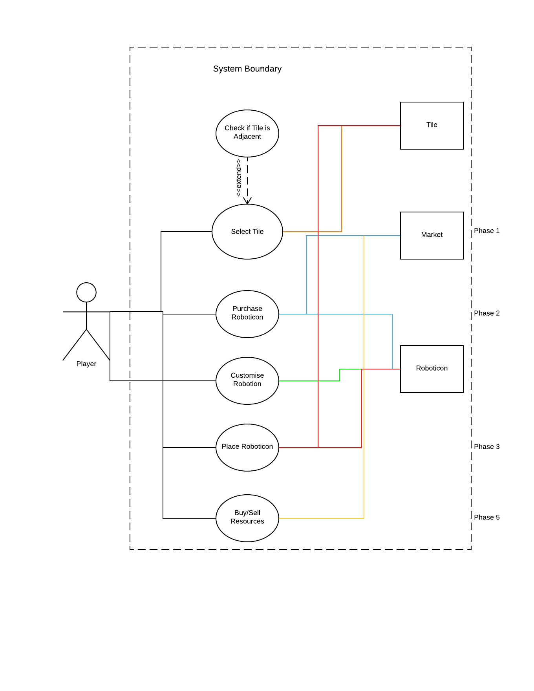

#Architecture

In order to develop an initial structure of the proposed architecture we used a use case diagram to show, with the help of the requirements, an abstract idea of the typical actions that a player would carry out during his/her turn. This behavioural model is a very basic representation that uses the key actions in each turn from the assessment brief as a basis, it gave us an idea of some of the objects that would be needed in the game and relationships between them. For instance, placing a roboticon required interaction with both a tile and a roboticon, therefore we could deduce that the tile object would have to have an attribute tracking the roboticons that it contained.

##UML Class Diagram

As our software will be object orientated, we decided that the best way to represent the static architecture of the software abstractly would be through the use of a UML class diagram. This would allow us to create an overall impression of how the main classes linked together and any additional attributes/methods that would be required to link them. UML 2 was the specific language used with the standard notation. [1]

To create the diagram, we used Lucidchart. One of the main reasons for doing so was because it was compatible with Google Drive which is the platform where all our documentation was initially stored. Because the software is both free and accessible online, it meant that no team member would have to download any software to their own computers or pay any kind of license fee. This meant the whole team could collaborate on the diagram without any hassle. It also worked like Google Drive in the sense that because it was stored using cloud storage, multiple users can edit the file at the same time. This became especially useful when we wanted to collaborate on the diagram during a team meeting. It also has a full range of shapes from the UML family that meant we could use standard UML notation and therefore avoid ambiguity on what shapes meant. It was also very customisable in the sense that it didn’t restrict us on the amount of abstraction that we wanted to apply. This is because the program simply supplied the shapes of a UML diagram and didn’t force us to use any kind of syntax. For instance we didn’t have to decide whether attributes were private or public and what type they were.       

##Justification of Model

One of the main objects we realised a player would interact with is the tiles of the map. As the tiles take on a rectangular appearance in a 4x4 grid as defined by our requirements, we decided that storing the tiles in a 2D array would be the most simplistic yet effective method. This is because it meant that the position of each tile could be determined by its position in the array instead of having attributes to store the x and y coordinates individually. These tiles would have their attributes, appearance and position defined before run time as the map isn’t randomly generated but assembled manually. The tiles will keep track of the player that owns it (if owned) as well as the roboticons that are stored on it. Due to tiles having the ability to hold multiple roboticons, it would store them using an array of the roboticon’s ID’s. Tiles can only be acquired by a player if it’s adjacent to one that they currently own so a method is needed to acknowledge this, given another tile as the input. 

Landmarks have an additional requirement of having their own special abilities so they would inherit from the tile class. In order to implement this functionality, we realised an effect class would be needed to created to store and apply the effect. The ‘duration’ attribute will store how long the effect is to be applied for and the ‘isActive’ attribute will signify whether the effect is currently active. This is because some effects, such as the College bonuses, may be applicable for the whole game where as another effect, for instance a landmark bonus, may provide an instant and one off resource boost. Each effect will be unique and will be applied using the ‘ApplyEffect()’ method. 

The game supports two players so there will have to be a player class for each one. The object for each player will store any data that is unique to them such as the resources they own and the college they decide to play as. Due to the ‘hot-seat’ nature of the gameplay the player class will also store whether the player is active or not. This will be toggled at the end of each round. Like the Tile class, the roboticons that are owned by the player will be stored as a list of their ID’s.

As each roboticon has unique properties such as it’s level for harvesting each resource, there would also have to be a class to represent them. The RoboticonID field would be the key value for each one. The roboticons initially belong to the market, so the attributes for the owner and the tile that they are stored on will start as being ‘NULL’. Through the process of generating the use case diagram, we also realised a market object would be needed to store the various prices and stock levels. As there is only one market, there will only ever be one instance of this class. The only major class it relates to is the Roboticon class as the market sells roboticons. It can contain zero to infinity of them as obviously the market can run out of stock of roboticons. It will also supply a gambling element to the game as specified within the brief. At this moment in time the exact composition of the gambling mechanic hasn’t been decided yet so it could range from a simple algorithm to a graphical minigame. However we do know that it will be run from a method within the market class. As the prices of the resources change based on the quantity that the market has, there will need to be a method to calculate these changes that is called before the auction phase. The calculations will be based on the law of supply and demand.

The random effects that happen during the game will inherit from the effect class as they differ in the sense that they have a chance of happening variable and can also only happen once during the game. Each player will have a college that they play as during the game with its own specific starting tile and unique effect. The name of the college can be changed by the player however this will be stored as a different attribute so the key field of the college isn’t changed.

As phases 2 and 3 have distinct time limits, an object for each of them is needed. This object will also contain the timer that will decrease using the ‘ReduceTime()’ method that will be called every second to decrease the time by 1. This is due to the time being stored in seconds also. ‘ResetTime()’ will be called when the player changes so the timer can be returned to it’s original length that is stored by the ‘StartTime’ attribute.

All of these objects will be created with the use of some kind of core game engine that we will write ourselves, it will also call the methods for each object based on the core game elements and the interaction from the user. We felt that given that the engine object interacts with every other object and also contains them all there wasn’t really any need to include it in the UML diagram. 

[1] "The class diagram", Ibm.com, 2016. [Online]. Available: http://www.ibm.com/developerworks/rational/library/content/RationalEdge/sep04/bell/. [Accessed: 04- Nov- 2016].

