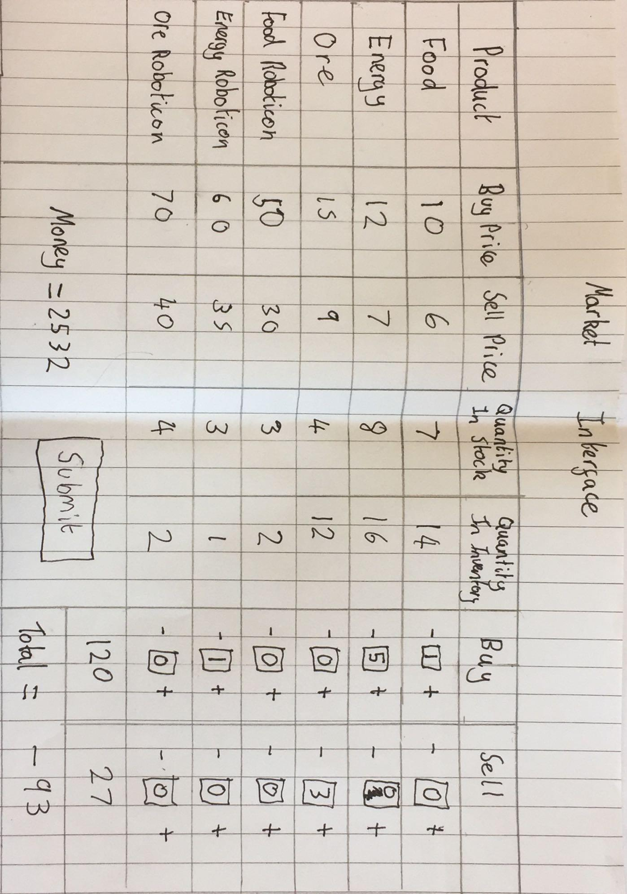
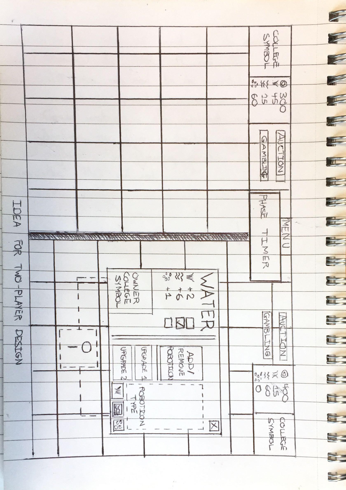
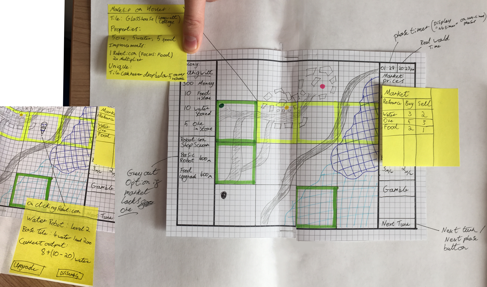
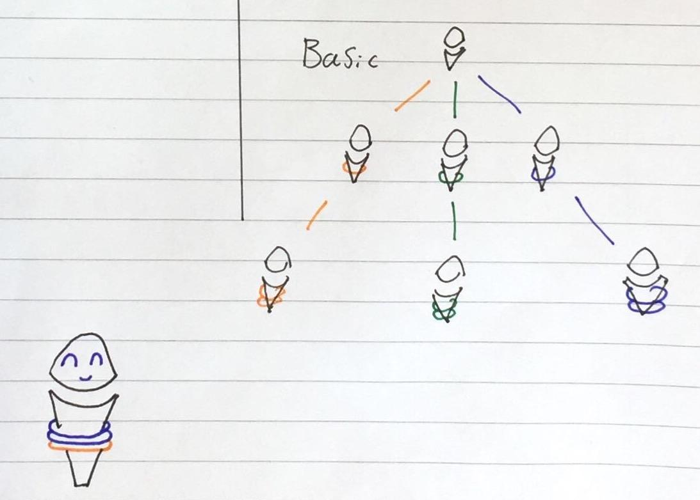
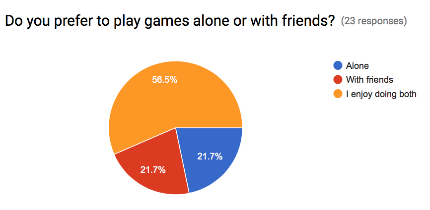
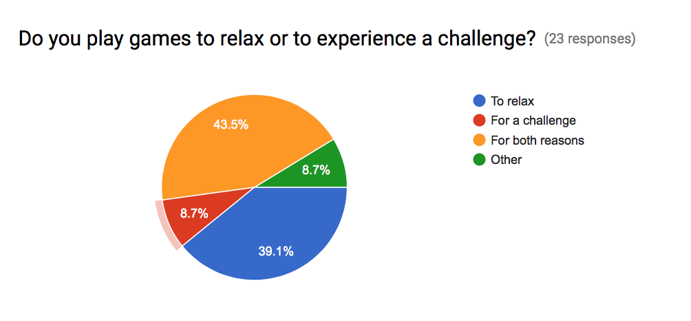
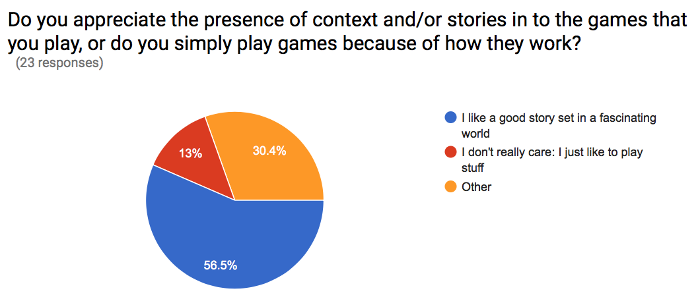
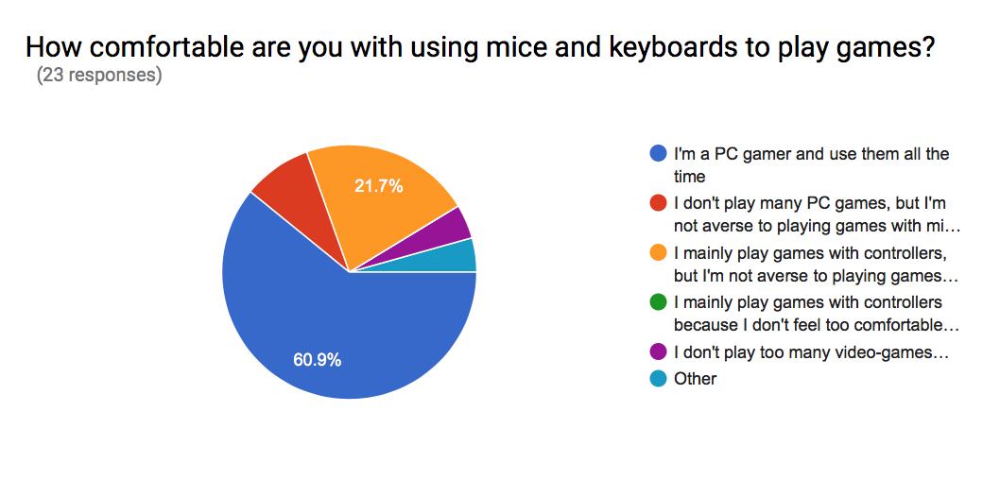

1. Stakeholder Interview 1 (Initial Discussion)

    1. *First of all, thank you for setting some of your time aside to talk with us today. We’d like to **start** this meeting off by asking you about your previous experiences with resource-management games like these: have you played any of them before? If so, what in particular compels you to play them? If not, what’s stopping you from enjoying those kinds of games?*

        1. **Our user has played and frequently plays resource management games. The features he feels exemplify the genre are:**

            1. **Economic trading elements**

            2. **Competitive and strategic elements**

            3. **Planning like the civilization series of games**

            4. **Play vs. AI provided it isn’t too smart and can be beaten normally**

    2. *Do you prefer playing games to relax, or to challenge yourself? Please explain your answer.*

        2. **Our user plays games to relax**

            5. **Therefore games aren’t meant to be a ridiculous master level challenge**

    3. *As a piece of non-factual media, our game is obviously going to have a theme that it will express through artistic direction, gameplay mechanics and a literal premise. What kind of tone would you like our game to have? Would you prefer it to be set in the context of an epic story, or would you just like some goofy showpiece that tries to make you laugh instead?*

        3. **Tone and feel are very important to the user, story is less so but can certainly set the tone of the game well**

        4. **Goofy and fun is completely fine with the user, games that make him laugh work well**

    4. *Given that we’re intending to make a game that isn’t too dis-similar to a board-game (wherein both players interact with a shared space and try to exploit it for all that it’s worth), would you prefer to play it with someone else simultaneously or in a "hot-seat" format?*

        5. **1v1 game format, hotseat works great**

            6. **Ideally have 30s-1min per phase maximum**

            7. **10mins to showcase all features of the game, 20mins maximum to finish the game otherwise it won’t be demo suitable**

    5. *Regarding graphics: would you prefer to be able to view a lot of information that’s relevant to the game (like income, influence and college statistics) on the heads-up display (HUD), or would you prefer to reserve most of it for sub-menus that need to be opened manually? In addition, how important are sophisticated graphics to you in games like this?*

        6. **Hide the information in sub menus and screens such as a market button to see the current resource prices etc, keep the UI simple and uncluttered**

    6. *What do you think about the applications and use of randomness in modern games? Do you believe that they’re exciting enough to make games more interesting, or do you think that they make your gaming experiences feel more superficial?*

        7. **Judicious randomness, some phases not random at all (i.e. phase 1)**

            8. **Use the random elements to add unforeseen challenges**

    7. *When you pick up a new game, do you find yourself playing it for a short period of time before you move on to something else, or would you be more likely to stick with it for a while?*

        8. **Short bursts of play, tends not to dedicate months to mastering something like a game**

    8. *Additional comments from the interview*

        9. **The user wants a low entry barrier for the game**

            9. **This implies learning as they play, no massive manuals or tutorials**

            10. **A manual or tutorial should be available if needed throughout the game**

        10. **Use a 4x4 grid for the map, keeps games short and ensures shorter bursts of play**

        11. **Keep college aspects fun and positive, nice idea as it adds personality but must show the University in a good light**

2. Stakeholder Interview 2 (Paper Prototype)

Artifacts constructed for interview:

	

1. Market popup design

b) Concurrent UI Design

c) Hot seat UI design

d) Roboticon Upgrade path design, showing multiple levels of resources acquisition and a roboticon with level 2 water and level 1 ore 

    9. **Generally a rectangular grid structure for the tiles would be the best option, it would be a lot more straightforward to code making it more likely that another group will pick our project**

    10. **The idea of tiles having their own unique advantages such as having an increased yield for a certain resource.**

        12. In terms of resources, Richard said that the idea of them being limited and possibly run out would be an interesting feature to add. From his point of view, providing a lot of disruption to the players strategy and trail of thought would be a good idea as it would minimise the game becoming some kind of mathematical formula.

    11. **Having  it so the players can only select the tiles adjacent to them would also provide more challenge and entertainment to the game as it would prevent players simply choosing the best tiles at the start and could include elements to the game such as trying to block off the opposing player’s tiles**

    12. **The GUI should be as simplistic as possible and values such as the market prices for resources should maybe be kept to a separate menu. More real estate is preferable to more information**

        13. **The separate colours for each player add to this and differentiate the two players**

    13. **Richard suggested the idea of having the prices of each resource unknown until the actual auction phase, this would prevent the market price of a resource influencing decisions a player makes such as choosing a tile**

    14. **Gambling should be included however it shouldn’t influence the outcome of the game or a player's strategy too much**

    15. **The auction house could provide some kind of competitiveness for example a player could buy all the stock of a certain resource so the other player couldn’t buy any of it**

    16. **The resource information of the opposing player shouldn’t be visible**

    17. **It may be a good idea to hide information when it comes to the statistics of a specific tile**

3. **Scenario Brief**

**		 	 	 		**

SEPR 2016-17 Scenario 1: Roboticon Colony of York

						

In the far distant future, the University of York campus has become the location of a colony, where freeholders compete to raise money, crops, and other resources in order to both survive and become the Vice-Chancellor of the Colony. You are to build a colonisation game for two players focusing on supply-and-demand economics, set on a futuristic University of York campus. The game will be round-based; each player takes a turn once in each round (the computer will also act as a player). In each turn, resources will be acquired and spent, random events (which may be good or bad) will take place, and an auction of resources will be held. Resources that are held at the end of the game (which will have a finite number of rounds) count towards the final score. The player with the highest score at the end of the game is spectacularly pronounced as the winner. Your game will ultimately have the following capabilities.

				

**●  A graphical user interface, which presents a map of the University, subdivided into ****_plots _****of land. Each plot should be of the same size, but may have different features (e.g., located next to a source of water, on a hill). Plots may partly or totally include buildings. At relevant times (see below) a player should be able to highlight a plot that they own and customise it in various ways.	**

**		**

**●  Support for three types of resource: Food, Energy and Ore, which are produced and which may be bought and sold.		**

**	**

**●  A ****_market_****, which will be used to buy and sell resources and equipment. The market initially has 16 units of Food, 16 units of energy, and no Ore. It also has 12 Robotic Assistants (aka Roboticons). New Roboticons can only be produced if the market has Ore. The market should also have a pub with a bar at in which money can be won or lost via "gambling" (also known as gambling).	**

**		**

**●  Random effects that come into play during a round. Example random effects might include: a meteor shower that damages a plot of land; a volcanic eruption; solar flares that temporarily improve the production of a resource; the unexpected appearance of Donald Trump dressed as a leprechaun (which destroys food production), etc.	**

**		**

**●  Support for acquiring and selling resources: resources are Food, Energy, and Ore. Each can be exchanged for money, and sometimes can be purchased for money.**						

**At the start of the game, all plots of land are unallocated, and each player has a small starting amount of money. As mentioned, the game is round-based. In each round, there are the following phases:				**

**						 						**

**			**

1. **Acquisition: Each player may acquire a previously unoccupied plot of land. Each plot has different strengths and weaknesses in terms of generating resources.			**

2. **Purchase and customisation: Each player may purchase a Robotic Assistant (aka a Roboticon). Roboticons can be customised to support food production, energy production or ore mining. Customisation also costs money.		**

3. **Installation of Roboticon: the customised Roboticon may be installed on a plot of land owned by the player. It is not required for a plot of land to have a Roboticon (but resource cannot be produced without a Roboticon).**

						

**Phases 2 and 3 should be time-limited; that is, as soon as Phase 2 starts, there should be a fixed time limit in which Phase 2 must be completed (and similarly for Phase 3)**

**						**

**After each player has gone through Phases 1-3 above, the following happens:	**

**Production: the colony produces (or fails to produce) Food, Energy and Ore				**

**Auction: the results of production can be sold in an auction. Each player may sell the Food, Energy or Ore that they produced to other players or to the market (which will have a fixed price at which it sells or buys). It is not necessary for every player to sell or buy resource at the auction.				 						**

**After the auction, the next round starts. The game ends at the end of the round in which the last plot of land has been allocated.**

						

Variation Points				

1. ●  The game must support at least two players (one of which may be a computer). There is no requirement to support networked play			

2. ●  You must decide on the strengths and weaknesses of plots of land in terms of their production of different forms of resource: not all plots will be good for producing each type of resource. For example, a plot of land near water may be good for producing food or energy, but not ore, whereas a plot near a hill may be good for produce ore and energy, but not food.				

3. ●  Each player, and their plots, must be uniquely identifiable on the map.			

4. ●  There is no requirement to support the entire University of York campus, but there must be at least three visibly identifiable landmarks (for marketing purposes)

5. 								

6. Constraints								

7. You are building a game that should be playable and enjoyable by your SEPR cohort. However, there are two stakeholders that you must also accommodate.						

1. *●  The customer: one of your lecturers will play the role of a customer who is interested in eventually trying to market and sell your game. Ultimately the customer is the person you must convince of the validity of your assumptions and decisions. This stakeholder can be contacted as often as you need and at any time (but do not expect an instant reply!).*

2. *				*

3. *●  The University of York Communications Office: who is interested in using your game for its own promotional activities, e.g., at Open Days, UCAS Days. Please note that you can only communicate with this stakeholder through the lecturers* 

4. **							**

4. Audience Questionnaire

    18. *Do you play resource-management games (like SimCity) or turn-based strategy games (like Civilization)? If so, what are the games that you play, and why do you like them?*

        14. **Our audience predominantly plays Civilization in relation to this genre, they enjoy:**

            11. **The turn based element**

            12. **The ability to apply strategy and planning**

            13. **Clear representation of progress and territory **

    19. *Do you prefer to play games alone or with friends?*

        15. The majority of our audience had no preference between playing alone or with friends, so two player and play vs AI should be implemented.

    20. *Do you play games to relax or to experience a challenge?*

        16. The majority of our audience prefered playing games to relax or to relax and for a challenge. Following this information and our Stakeholder’s opinion, the game should be aimed towards more relaxing gameplay.

    21. *Do you appreciate the presence of context and/or stories into the games that you play, or do you simply play games because of how they work?*

        17. The audience prefers story and context in games just like our stakeholder, the game should have some sort of setting and context

    22. *What's your favourite gameplay aspect or feature in any resource-management game?* If you don't have one, have you ever had any ideas for a game mechanic that you'd like to see in one? *(EXAMPLE: The requirement to adapt tile improvements in Civilization constantly in response to changes in income, growth or population happiness)*

        18. **The main aspects our audience enjoy are:**

            14. **Technology synergies and development**

            15. **Progression line like a technology tree**

            16. **Exponential growth of resources**

            17. **Finding a meta strategy (The most efficient way to play)**

    23. *Tell us what you think the most important aspect of any game is (besides gameplay).*

        19. **Most important game aspects**

            18. **Good UX**

            19. **Feeling of progress and accomplishment**

            20. **Good backstory**

    24. *How comfortable are you with using mice and keyboards to play games?*

        20. 

    25. *What are your feelings regarding the application of randomness to certain elements of multiplayer games? (EXAMPLE: Having a chance to miss any shot that you take in XCOM, which scales up or down with how clear your shots are)*

        21. **The overall feeling agreed with our key stakeholder, randomness is fun when it doesn’t decide the game entirely.**

        22. **Randomness works well in short fast paced games and increases replayability**

5. "Supply and Demand." Merriam-Webster.com. Accessed October 31, 2016. http://www.merriam-webster.com/dictionary/supply and demand.

6. "Economics Basics: Supply and Demand" Investopedia.com. Accessed October 31, 2016. http://www.investopedia.com/university/economics/economics3.asp

7. Game research

<table>
  <tr>
    <td>Sim City 4</td>
  </tr>
  <tr>
    <td>Positive Points (Noted in Reviews)
Sleek, attractive interface
Complex and detailed strategy game
"I strongly recommend not fixing the stability issues if you have a job and/or family. This game is seriously addictive, so it helps to have the crashes as an automatic reminder you need to get back to the real world"
There’s a massive amount of customisation available to the player ranging from organising traffic to deciding how to dispose of the city’s waste

Negative Points (Noted in Reviews)
Poor graphics(although probably quite good at the time of it’s release(2003)
Not as polished as it could have been
“Just generally disappointing and overly complicated”</td>
  </tr>
  <tr>
    <td>Potential Requirements for our own project
Lot’s of customisation can prove to make the game a lot more engaging and fun to play however too much will make the game too difficult for casual gamers.
They’re a lot of examples in this game of buildings helping generate resources faster, such as a windmill farm for energy. Some of them could be possibly implemented. E.g. The player can buy a drill using their money to improve the production speed of ore or a combine harvester to increase the production speed of food.
</td>
  </tr>
</table>

<table>
  <tr>
    <td>Civilization V</td>
  </tr>
  <tr>
    <td>Description of Gameplay and Premise
A flagship turn-based strategy game where you can become the ruler of the world by establishing and leading a civilization from the dawn of man into the space age; wage war, conduct diplomacy, expand economies, discover new technologies and go head-to-head with other civilisations. The game uses hexagonal sections of land which players can control and traverse.

</td>
  </tr>
  <tr>
    <td>Positive Points (Noted in Reviews)
Unique Units and Buildings do a variety of different and interesting things
The GUI
Hexagonal sectioning
Trade

Negative Points (Noted in Reviews)
"Tedious" - Takes too long
“Full of Bugs”
“Dumb AI”</td>
  </tr>
  <tr>
    <td>Potential Requirements for our own project
Quick game duration
Control of specific buildings could provide unique bonuses</td>
  </tr>
</table>

<table>
  <tr>
    <td>Factorio</td>
  </tr>
  <tr>
    <td>Description of Gameplay and Premise
Factorio is described on Wikipedia as "a resource-gathering game with real-time strategy and survival elements" wherein “the player has to survive by finding and harvesting resources to build tools and machines”.
Much like what we’re intending for our game to be, the gameplay that forms the basis of Factorio hinges on a development system that enables the player’s capabilities and available options to snowball over time. Basic resources and materials can be found and put to use in attaining more lucrative resources, which can themselves contribute to the construction of sophisticated technologies for use in ever-expanding factory environments. Players are expected to build up factories in this way throughout the infinitely-sized, randomly-generated worlds that Factorio plays out on, such that their operations can eventually be automated by a mechanical workforce comprising of machines, drones and augmented labourers.
Factorio’s formal win-condition can be reached by building a satellite and a rocket to launch with that satellite, although the game doesn’t coerce its players towards that outcome: indeed, there’s nothing to stop them from simply ignoring that goal and building some frankly ridiculous industrial compounds instead.
The game establishes a basic premise to contextualise how it plays and where it’s set: it apparently follows an astronaut (the player), who is now stranded on an alien planet and separated from the rest of their crew following a crash-landing accident that also killed the rest of their unit.

</td>
  </tr>
  <tr>
    <td>Positive Points (Self-Judged)
Factorio’s art-style is heavily reminiscent of 90s’ simulation games (such as SimCity and Rollercoaster Tycoon) in that it’s made up entirely of fairly detailed 2D sprites. This is quite an uncommon art-style to see in 21st-century games and it definitely feels refreshing in a sea of dreary, high-budget 3D games and low-detail indie platformers.
Although the game evokes memories of Minecraft in providing a mixture of survival gameplay, resource management and creative potential, I can’t see anything to suggest that Factorio requires players to spend a lot of time mining for resources manually, which was easily the most boring part of Minecraft.
Factorio is played from a top-down perspective, much like Civilization and SimCity, but you retain control of a player character unlike those games. Along with increasing the player’s sense of presence in the game’s environment (and thereby contributing to the feeling of always having something to do), this also has strategic implications that contribute to the game’s depth, as critical and time-sensitive changes to constructions can’t always be enacted so quickly if your character happens to be far away from whatever you may need to work on at any given time.
It must feel really, really satisfying to build a crazy factory that works at peak performance and then stand back to have a look at your masterpiece in action.

Negative Points (Self-Judged)
Factories in Factorio have the potential to become wildly complex if they aren’t organised carefully, which may put more mental strain on some players than what they can bear.
For a game as liberating as this, I’m somewhat disappointed that there only seems to be one formal win-condition.</td>
  </tr>
  <tr>
    <td>Positive Points (Noted in Reviews)
The game’s pace never seems to stall, as players are very rarely left without anything to do for the benefit of their cause. At any given moment, a player will almost always be able to mine for additional resources, undertake a new building project or launch an attack on a hostile entity, thereby fostering the “one more turn” mentality which can often make many games in Factorio’s genre so addictive.
Although the game does have a formal win-condition, players seem to like how much freedom and how many choices Factorio grants them, giving off the impression that the game is very laissez-faire about how players go about making the most of their randomly-generated worlds (regardless of whether it ends up benefiting them or not).

Negative Points (Noted in Reviews)
For as liberating and as wildly creative as it can be, Factorio seems to have one hell of a learning curve precisely because of how much control it leaves to its players. Because the game doesn’t explicitly tell players what they have to do, most new players will have to work out the game’s mechanics for themselves before they can really start to enjoy it, and that may not be the easiest task in the world for some players to undertake.
Some players who weren’t so compelled to go crazy and build ridiculous factories eventually found themselves getting bored in trying to top their high-scores, which can only really be set by trying to reach the game’s formal win-condition in as little time as possible.</td>
  </tr>
  <tr>
    <td>Potential Requirements for our own project
Players must be able to perform actions while resources are being retrieved, Roboticons are being built and additional land is being taken: down-time must be kept to an absolute minimum.
In order to emphasise the importance of carrying out actions quickly (which exists due to the presence of time-limits in our game), players should not be able to move around our game’s world as freely and as quickly as possible: this restriction can be imposed conveniently by having players take control of in-game avatars who must be moved around in order to execute players’ plans.
Tiles in the game should be reasonably large such that the environment cannot become overcrowded with tile improvements.
Players must always be left with objectives to fulfill at any and all points throughout the game’s duration: they should never be left without anything constructive to do. Exactly how we will achieve this requirement is something that we can deliberate over when drafting up the game’s core mechanics.
The game must begin with a brief tutorial that informs players of the game’s mechanics, their available choices, the possibilities achievable and also what they should try and work towards.</td>
  </tr>
</table>

<table>
  <tr>
    <td>Europa Universalis IV</td>
  </tr>
  <tr>
    <td>Description of Gameplay and Premise

Europa Universalis IV is a grand strategy video game and it plays like a real-time version of a tabletop board game.You can pause the game and change its speed at any time. Combats are resolved with dice rolls influenced by modifiers such as terrain, weather, and generals. This is a game about royal marriages, colonization, trade, social and political intrigue, warfare, religious strife, and revolution. Victory is score-based. Of particular note is the terrain map that is filled with details like lakes that slowly freeze over during winter, birds flying overhead, swimming whales and ect.

</td>
  </tr>
  <tr>
    <td>Positive Points (Noted in Reviews)

"Full of depth and history"
Complex but enjoyable after mastering
Good graphic
</td>
  </tr>
  <tr>
    <td>Negative Points (Noted in Reviews)

“...the text is far too small, and really the whole UI is way too small. It's like paradox is trying to show off as much of their map as possible, but it's really unspectacular anyway. Horrible, tiny, little icons spread all the way around the map, things should be centralized to one side, or two at most.”
“This is a really slow game, very hard to get into unlike other games where you can hop right in, pick it up more or less right away, and only have to learn about or research a few alien principals or gameplay mechanics. I'm sure it's satisfying for those that enjoy it, but it's DEFINITELY not created in a way that will appeal to a wider spectrum of gamers and gaming styles. “
“This is randomizer - not a strategy game. Random unpredictable game events, random battle results.”
“After about 25 hours I decided I'd had enough. I entirely appreciate the hard work and research that went into this game, but when I play a game I'm looking for entertainment, not a history lesson. “ 
“Lack of tutorials.”</td>
  </tr>
</table>

8. **"****The IEEE standard for requirements documents"  **ifs.host.cs.st-andrews.ac.uk. Accessed October 11, 2016. https://ifs.host.cs.st-andrews.ac.uk/Books/SE9/Web/Requirements/IEEE-standard.html

