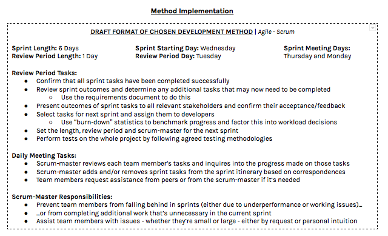

Plan and method selection
=========================
Something not look right? We reccommend you use the most up to date and friendlier version of the documentation found `here <https://github.com/jm179796/SEPR/blob/Assessment1_Docs/Plan1.pdf>`_

Model and Method Selection
--------------------------

In keeping with a formal developmental process, the work to be
undertaken from this point on will need to be fit around an engineering
model and carried forward by a supplementary methodology. These two
terms are often used interchangeably, but they actually define entirely
different things: whereas a model can set "the order of the stages
involved in software development" [9] and the overall criteria for
moving between those stages [9], a method will instead detail exactly
how a team can navigate through those stages and meet the aforementioned
criteria [9]. This carries the obvious connotation that developmental
methods can only be fit around engineering models, so it was
understandably necessary to take a decision on an appropriate model
before implementing and adapting a suitable methodology around the rest
of the project.

Research was made into a variety of models - including the waterfall [9]
[10], spiral [9], V-model [10] [11] and evolutionary models [9] [12],
amongst others - and considerations were made on which of them would fit
most optimally around the project’s scope and the upcoming commitments
of the development team’s members. Unsurprisingly, each model had their
own appreciable benefits: the waterfall model wouldn’t have required a
great deal of planning to implement because of how linear it is [9]
[10], whereas the evolutionary and spiral models cater quite well to
changes in customers’ requirements on account of their iterative
components. [9] [12] However, in spite of their advantages, it was
ultimately agreed that all of these traditional models were simply too
rigid for a team of our size, experience and physical proximity to take
up without compromising heavily on working efficiency.

The project’s requirements are going to be altered as it progresses,
given that many game-design decisions are typically made after
stakeholders test prototypes - and being unable to respond to
directional changes because of some rigorous engineering model’s
arbitrary guidelines would severely impact upon the likelihood for a
working, well-design game to be delivered within the project’s strict
time-constraints. Furthermore; while documentation will be needed to
create reference points from which further work and decisions can be
derived, most traditional models call for particularly excessive amounts
of documentation to be written up [9] [10] [11] [12] (especially about
concepts and designs that end up having absolutely no developmental
bearing whatsoever) and it simply wouldn’t be productive to write more
than what is truly necessary to suitably inform all pending design
decisions.

As the project concerns the development of a game: a type of product
that, unlike a strictly functional application, can only be assessed
subjectively and will differ in perceived "quality" from
person-to-person. The game that comes out of this project will only be
as good as what the project’s primary stakeholder deems it to be, so a
significant part of the work that the project carries will basically be
dictated by that stakeholder. Traditional models, however, limit
stakeholders’ influences during design and implementation phases [9]
[10] [11] [12]: hence, if one was to be adopted for this project, the
potential for our primary stakeholder’s requests to be ignored and for
precious time to be wasted on implementing unrequested features instead
would be drastically raised.

Rather than fitting the rest of the project around a traditional model,
it would be more suitable to direct it ourselves by a set of principles
with the aim of making it feel as efficient and as flexible as possible
to get through. Hence, the next stage of the project will be fit around
the agile philosophy, which is described in the figure that
follows. This is a direct response to the traditional issues of software
development that were raised in the last two paragraphs, as is
exhibited by the "agile manifesto" [13] - along with enabling all of us
to direct and work on the project in any manner that we or our primary
stakeholder see fit, it should leave the door open for another team to
pick up the project and run with it in whatever manner they may choose
to.

.. figure:: plan0.png
   :alt: image alt text

Once an agile model was chosen for the project’s procedure, a
methodology needed to be fit around it. Once again, numerous
methodologies - including the extreme programming [15] [16], dynamic
systems development [17] [18], feature-driven development [19] [20] and
agile unified process methods [21] - were considered, and each had their
appreciable advantages: XP’s focus on responding to user stories is
suitably client-centric enough to satisfy our obligations to the
project’s primary stakeholder [15] [16], whereas the DSD and FDD methods
each encourage prototyping and testing to such an extent that could
potentially allow for the project’s requirements to be finalised quite
early on [17] [18] [19] [20]. In the end, though, the scrum methodology [22] was chosen for how well it can leverage frequent
communication for productive benefit and for how it could enable the
rest of the project to be fit around the team’s shared university
schedule and individual commitments.

.. figure:: plan1.png
   :alt: image alt text

+------------+-----+-----------------------------------------------------------+
| LIST OF    |     |                                                           |
| PROJECT    |     |                                                           |
| RESOURCES  |     |                                                           |
+============+=====+===========================================================+
| Task       | Pro | Use(s) in Project                                         |
|            | duc |                                                           |
|            | t   |                                                           |
+------------+-----+-----------------------------------------------------------+
| Version    | Git | Allows coding work to be reverted if stakeholder          |
| Control    | Hub | requirements change; prevents unauthorised changes to     |
|            |     | work (and requires the entire team to approve of any      |
|            |     | changes to the game’s master copy); facilitates           |
|            |     | prototyping through branching                             |
+------------+-----+-----------------------------------------------------------+
| File-Shari |     | Repository acts as an online source for implementation    |
| ng         |     | work, enabling the entire team to access one-another’s    |
|            |     | contributions flexibly and independently                  |
+------------+-----+-----------------------------------------------------------+
|            | Goo | Acts as an online source for all non-implementation work  |
|            | gle | and resources, including documentation and meeting        |
|            | Dri | records                                                   |
|            | ve  |                                                           |
+------------+-----+-----------------------------------------------------------+
| Documentat |     | Includes a web-hosted word-processor through which        |
| ion        |     | documentation can be accessed and edited collaboratively  |
+------------+-----+-----------------------------------------------------------+
| Burn-Down  | Zen | Automatically measures task completions over sprints’     |
| Analysis   | Hub | durations and uses them to generate “burndown charts”     |
|            |     | showing whether or not sprints are on-track               |
+------------+-----+-----------------------------------------------------------+
| Task       |     | Allows task-lists and sprint-lists to be logged directly  |
| Management |     | within our chosen VCS and our game’s repository,          |
|            |     | providing flexible access to those backlogs and assisting |
|            |     | in assigning tasks to particular team members             |
+------------+-----+-----------------------------------------------------------+
| Communicat | Sla | Provides a reliable way for team members to remain in     |
| ion        | ck  | contact by maintaining a private online chat-room for the |
|            |     | team to access at any time                                |
+------------+-----+-----------------------------------------------------------+
| UML        | Luc | Partially automates the creation of UML diagrams and      |
| Modelling  | idC | use-case diagrams, which will be required to describe our |
|            | har | game’s internal architecture and how the game’s players   |
|            | t   | will ideally interact with it                             |
+------------+-----+-----------------------------------------------------------+
| Project    | Sma | Facilitates the construction of Gantt charts, such as the |
| Planning   | rts | prototype time-planning chart that’s referred to in the   |
|            | hee | “Project Plan” section on the next page                   |
|            | t   |                                                           |
+------------+-----+-----------------------------------------------------------+
| Testing(Fo | Tra | Augments our chosen VCS with external servers on which    |
| llowing    | vis | new commits can be tested prior to being pulled (through  |
| Continuous | CI  | an online terminal), preventing the need for the files    |
| Integratio |     | changed in such commits to be downloaded, compiled and    |
| n)\*       |     | tested manually instead                                   |
+------------+-----+-----------------------------------------------------------+

The outcome of each task will be tested individually through Travis
CI as such outcomes will be required to be committed to our VCS once
they take form

--------------

Method Implementation
---------------------

Justifications for Implementation Decisions
-------------------------------------------

-  Sprints ensue from week-to-week so that they align with the team’s
   shared university time-table

-  Sprints begin on Wednesdays because the team generally has few other
   commitments to meet on that day, enabling each sprint to begin with a
   burst of work

   -  Also allows review meetings to be scheduled for Tuesdays, on which
      there are many time-slots over which the team is typically
      available to meet

-  Sprint meetings are to be held on Thursdays and Mondays, allowing the
   team to remain synchronised and up-to-date while also leaving enough
   time for considerable progress to be made between meetings

-  Different scrum-master set each week to balance additional
   scrum-master workloads between colleagues

-  Tasks will be set such that each team-member will have roughly the
   same amount of work to do during each sprint; this obviously means
   that different numbers of tasks may be assigned to different
   team-members (as some tasks will take more work to complete than
   other)

   -  The combined workload warranted by each sprint will be judged
      using burn-down statistics

   -  Each task in the project’s backlog will be assigned priorities and
      weights to help judge individual task workloads

--------------

Project Plan
------------

**The complete timetabled plan for this project is too large to be shown
here, the file "SEPR Schedule.png" can be referred to to see this
document (Located on the github).**

**What follows on this page is a textual transcription of the plan,
complete with priority numbers.**

.. figure:: plan3.png
   :alt: image alt text
